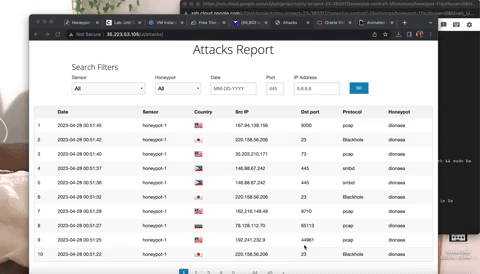

# Honeypot Assignment

**Time spent:** **9** hours spent in total

**Objective:** Create a honeynet using MHN-Admin. Present your findings as if you were requested to give a brief report of the current state of Internet security. Assume that your audience is a current employer who is questioning why the company should allocate anymore resources to the IT security team.

### MHN-Admin Deployment (Required)

**Summary:** How did you deploy it? Did you use GCP, AWS, Azure, Vagrant, VirtualBox, etc.?
- I used VirtualBox and Cengage to deploy it. Using Cengage, I was able to put in my IP address where attacks were granted via map. I was able to see the different attacks with the various IP address and the specific times. 

### Dionaea Honeypot Deployment (Required)

**Summary:** Briefly in your own words, what does dionaea do?
The dionaea allows you to see the attacks from payloads and malware. It was granted to be a nepenthes successor, embedding python as scripting language, using libemu using multiple shellcodes. 

### Database Backup (Required) 

**Summary:** What is the RDBMS that MHN-Admin uses? What information does the exported JSON file record?
The RDBMS that the MHN-Admin uses is the SQL Server and the information the exported JSON file recorded was the ‘session.json’ file. This file was created by collected the data from my honeypots. 

*Be sure to upload session.json directly to this GitHub repo/branch in order to get full credit.*

